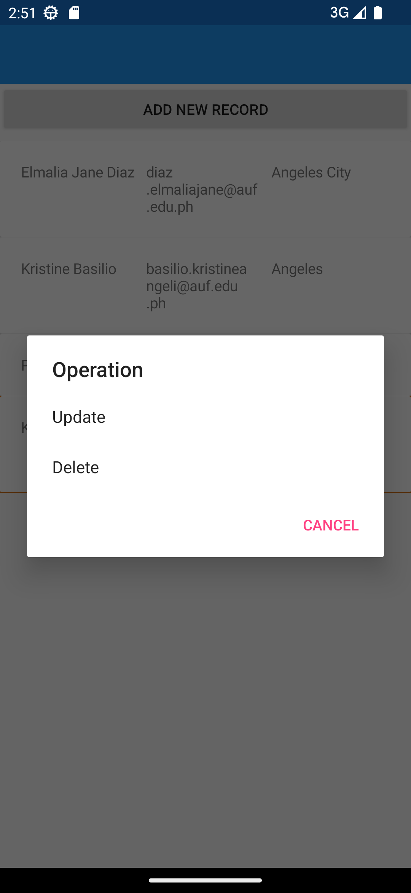

# Module 06 - Activity 02 (PDC03-LAB)

    Name of Student: Elmalia Jane S. Diaz
    Year and Section: BSIT3A
    Activity Title: Module 06 - Activity 02
    Date Submitted: May 24, 2024

## Add
### Output Screenshots

    
    
    

## Update
### Output Screenshots

    
    
    

## Delete
### Output Screenshots

    
    

